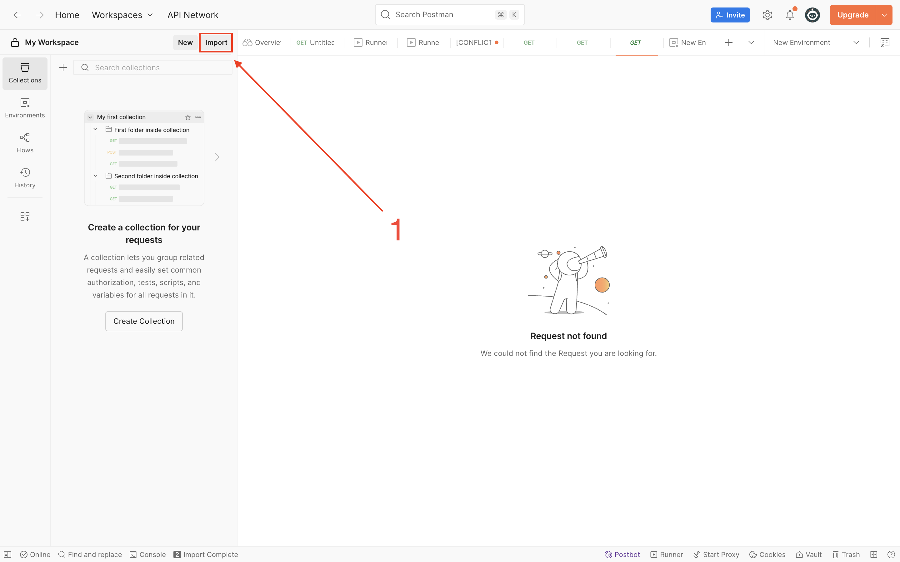
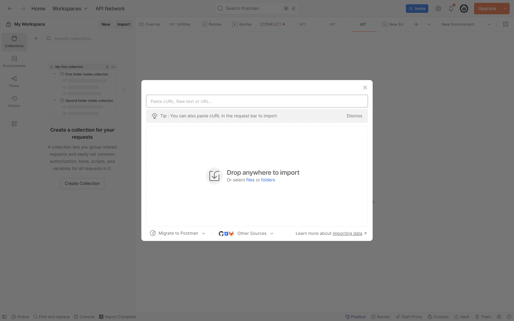
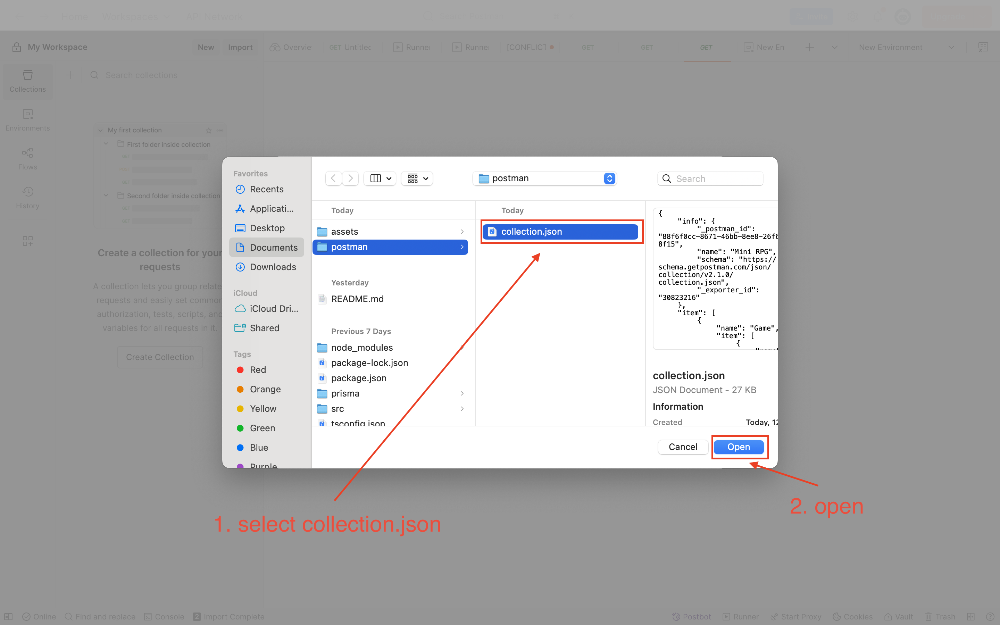
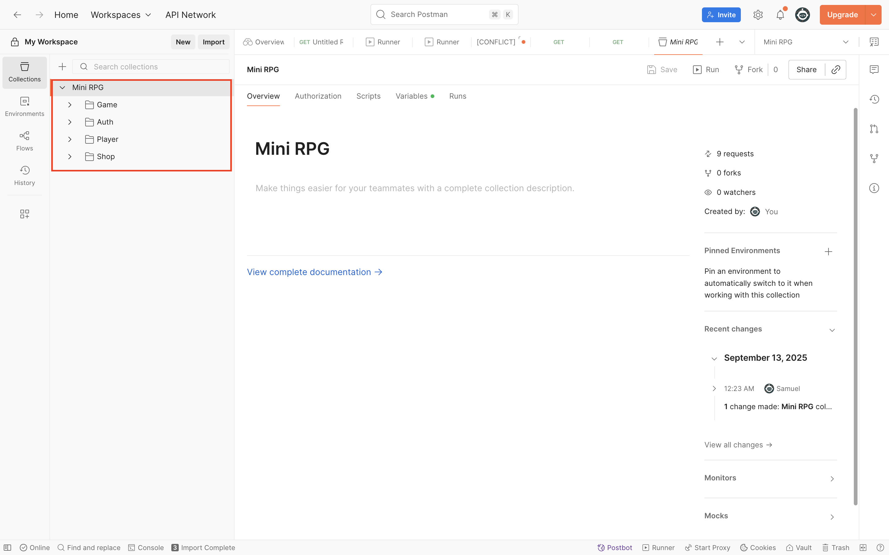
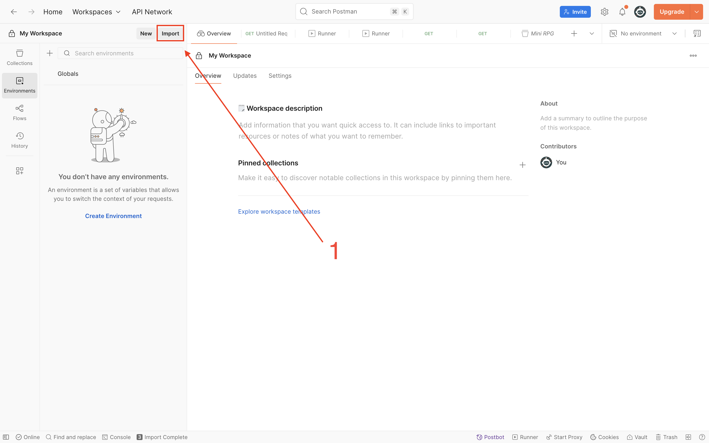
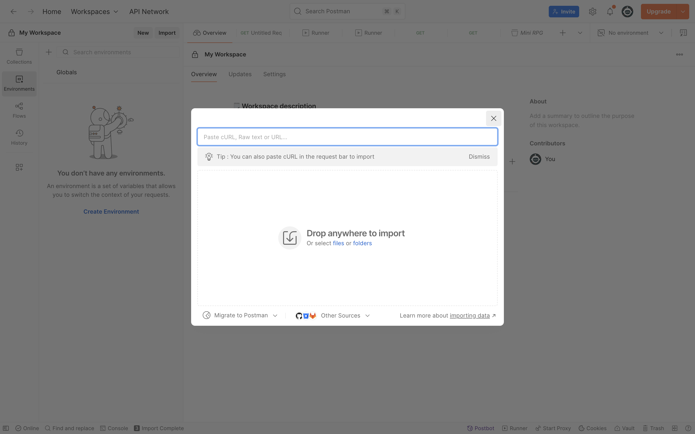
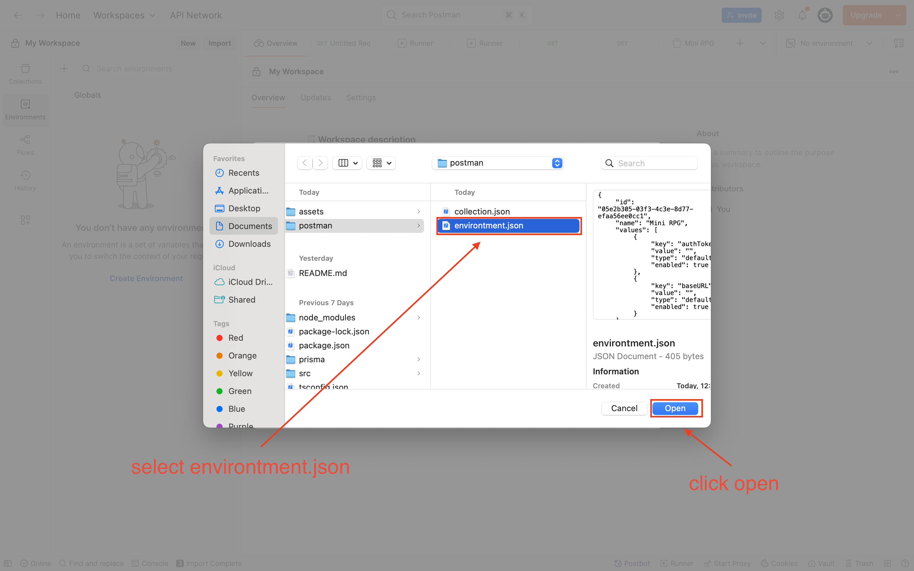
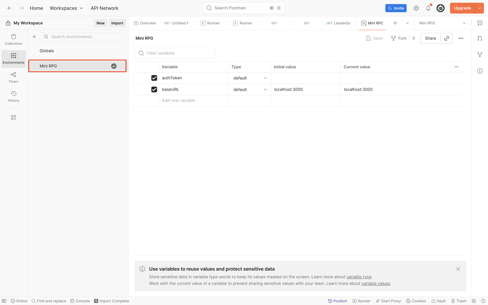

## Setup Instructions

1. Clone the repository

```bash
git clone https://github.com/ToxicAura60/Mini-RPG.git
cd Mini-RPG
```

2. Install dependencies

```bash
npm install
```

3. Create env file based on .env.example

```bash
cp .env.example .env
```

4. Run database migrations

```bash
npx prisma migrate dev --name init
```

5. Seed database

```bash
npm run prisma:seed
```

6. Run the code

```bash
npm run dev
```

## Import Postman Collection and Environment

- The collection file is located in the `postman` folder:  
  `postman/collection.json`
- The environment file is also in the `postman` folder:  
  `postman/environment.json`


#### 1. Import collection






#### 2. Import environment






## How Item Prices Increase When Buying Multiple Items
Whenever a player buys an item in the game, the price of the item increases based on how many of that same type (rarity) the player already owns.

* Starting price: The item has a base price, let’s say 10 coins.
* Multiplier: Each item has a “multiplier” number, like 2. This controls how quickly the price increases.
* Buying multiple items: The game calculates the total cost by looking at how many of that rarity the player already has.

Here’s an example with a multiplier of 2:

1. Player has 0 rare items and buys 2:
    * 1st item: 10 × 2^0 = 10 coins
    * 2nd item: 10 × 2^1 = 20 coins
    * Total: 10 + 20 = 30 coins
2. Player now has 2 rare items and buys 1 more:
    * 3rd item: 10 × 2^2 = 40 coins
    * Total: 40 coins
3. Player has 3 rare items and buys 2 at once:
    * 4th item: 10 × 2^3 = 80 coins
    * 5th item: 10 × 2^4 = 160 coins
    * Total: 80 + 160 = 240 coins

So basically: the more of the same type you already have, the more expensive the next ones become, and the multiplier controls how quickly the price rises.

